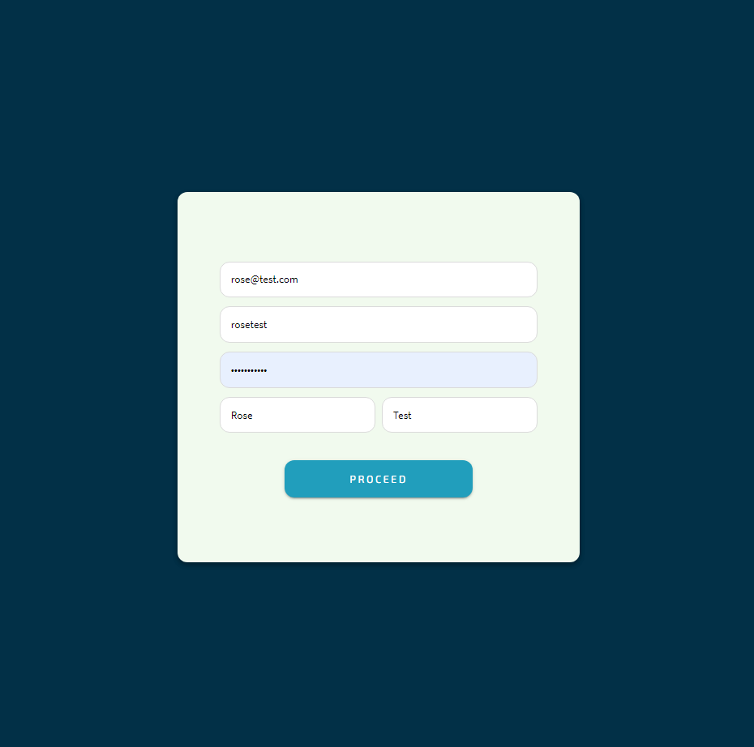

[![Heroku Status][heroku-shield]][heroku-url]
[![LinkedIn][linkedin-shield]][linkedin-url]


<br />
<p align="center">
  <h1 align="center">Realtime Chat App Backend</h1>
  
  <p align="center">
    The server side of a web-based messaging application that delivers messages instantaneously.
    <br /><br />
    <a href="https://rose-chat-client.netlify.app"><strong>View Demo »</strong></a>
    <br /><br />
    <a href="https://github.com/rosebilag/chat-backend/issues">Report Bug</a>
    ·
    <a href="https://github.com/rosebilag/chat-backend/issues">Request Feature</a>
  </p>
</p>


<h2 style="display: inline-block">Table of Contents</h2>
<ol>
  <li>
    <a href="#about-the-project">About The Project</a>
    <ul>
      <li><a href="#built-with">Built With</a></li>
    </ul>
  </li>
  <li>
    <a href="#getting-started">Getting Started</a>
    <ul>
      <li><a href="#prerequisites">Prerequisites</a></li>
      <li><a href="#installation">Installation</a></li>
    </ul>
  </li>
  <li><a href="#usage">Usage</a></li>
  <li><a href="#contact">Contact</a></li>
</ol>


## About The Project

### Built With
* [React](https://reactjs.org/)
* [Socket.io](https://socket.io/)
* [Typescript](https://www.typescriptlang.org/)
* **[Node.js](https://nodejs.org/en/)**
* **[MongoDB](https://www.mongodb.com/)**


## Getting Started
To get a local copy up and running follow these simple steps.


### Prerequisites
Install latest version of npm
* npm
  ```sh
  npm install npm@latest -g
  ```

### Installation
1. Clone the project
   ```sh
   git clone https://github.com/rosebilag/chat-backend.git
   ```
2. Go to project directory and Install NPM packages
   ```sh
   npm install
   ```
3. Create config.env file and specify values for the ff.
   ```sh
   PORT, DATABASE_URL, SECRET_KEY
   ```
4. Start the application
   ```sh
   npm run dev
   ```


## Usage
**Creating an Account**


1. In the login page, click 'Register here'.
2. Input the necessary fields. Don't worry. It won't take long.
3. You'll be redirected to the login page. Enter your newly created credentials.


**Creating a Room**


1. Click the message icon on the sidebar header.
2. Inputing the necessary fields.
3. Share the randomly-generated room code with people you want to invite in the room.


**Joining a Room**


1. Obtain the room code from the room creator.
2. Click the message icon on the sidebar header.
3. Click 'Join Room' tab option.
4. Input room code and proceed.


## Contact
Rose Bilag - [LinkedIn](https://linkedin.com/rosejoybilag) - hello@rosebilag.com

Project Link: [https://github.com/rosebilag/chat-backend](https://github.com/rosebilag/chat-backend)


[heroku-shield]: https://img.shields.io/github/deployments/rosebilag/chat-backend/rose-chat-backend?style=for-the-badge
[heroku-url]:https://rose-chat-backend.herokuapp.com
[linkedin-shield]: https://img.shields.io/badge/-LinkedIn-black.svg?style=for-the-badge&logo=linkedin&colorB=555
[linkedin-url]: https://linkedin.com/in/rosebilag